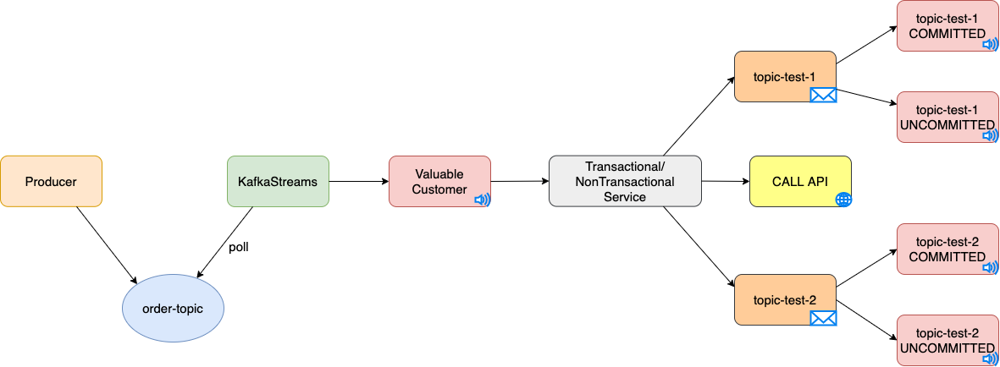

# Event-Driven Spring Boot apps with Kafka Streams
The idea of this project is to demonstrate communication between multiple Spring Boot applications using Kafka Streams.

### Story behind this project
With this project, we want to demonstrate the purchase of products via the webshop.

Imaginary preliminary steps:
1. The user registered on the webshop and decided to buy several products.
2. The user has decided to transfer money on the webshop that he is ready to spend.
3. After the user has added products to the cart, he has decided to make a purchase.
4. After clicking "Buy Now" flow starts

## Key Components
• Events module contains pojo event classes through which information is distributed between different Spring Boot applications

• Generator module serves as a source from which information is sent to the Kafka topic

• Transformer module serves as a central place where messages arrive. Transformation and redirection of messages to other Kafka topics is done via Kafka Streams

• Payment service module is used to check the amount that the user has on the account and reserve money when purchasing products

• Stock service module is used to check the status of product in the warehouse and product reservations when purchasing

• Order service module is used to check the status of the payment service and the stock service. Depending on the status of the customer, the purchase is successfully processed or not processed

## Technologies used
- **Java 21**
- **Spring Boot 3.3.3**
- **WireMock**
- **Awaitility**
- **Testcontainers**
- **Apache Kafka**
- **Apache Kafka Streams**

## Communication between components


### Business logic behind communication
Generator module imitates the user's purchase of a products every 5 seconds. OrderEvent is sent to the topic "orders".

Transformer service transforms the OrderEvent into an OrderFullEvent. In other words, it enriches the new "OrderFullEvent" event with information on the total number of products and the final price.
The status of the OrderFullEvent is set to NEW. OrderFullEvent is sent to the topic "orders-full".
- If the user has spent more than 4000€ on a purchase, information about the user and the purchase is automatically sent to the topic "valuable-customer". For example, we can send newsletters for more expensive products to such users in the future
- If the user has bought more than 10 products, information about the user and the product is sent to the topic "full-mini-cart"
- If the user has purchased more than 5 products, information about the user and the product is sent to the topic "half-full-cart"

Payment service checks whether the user has sufficient funds to purchase the products.
The RocksDB database is used in the background, where information about the current amount the user has is stored.
If the user has enough money, the money is reserved and the status "ACCEPT" is set, otherwise the status REJECT is set.
OrderFullEvent with newly set status is sent to topic "payment-orders".

The stock service checks whether there are enough products in stock.
The RocksDB database is used in the background, where product inventory data is stored.
If there are enough products in stock, the products are reserved and the status "ACCEPT" is set, otherwise the status REJECT is set.
OrderFullEvent with newly set status is sent to topic "stock-orders".

Order Service serves as a place that combines events from two different topics and makes a decision whether the order will be processed successfully or not.
If we receive the status ACCEPT from the payment service and the stock service, the order will be successful.
If we receive a REJECT status from the payment service and stock service, the order will be unsuccessful.
If we receive the status ACCEPT from one service, and REJECT from another service, in that case the Order service sets the status Rollback.
Rollback status means that the reservation will be canceled, that is, the reserved money will be returned to the account and the reserved products will be returned to the stock.

## Appendix (Kafka Transactions Exactly-once semantics)


### Story
The idea of part is to show how Kafka Producer and Consumer behave as transaction and non-transaction.
In the picture, the producer sends a message to the topic "order-topic".
Kafka Streams reads messages from the "order-topic" topic and sends them to the "valuable-customer" topic.
Kafka Consumer reads messages from the "valuable-customer" topic and, depending on the number of products, is sent as an idempotent (transactional) producer or a non-idempotent (non-transactional) producer.
In order for Kafka Consumer to support transactional access, it is necessary to set the isolation level read committed or read uncommitted for non-transactional access.

### Idea
The idea is to test how the Kafka Producer will behave if an error occurs and the Kafka Consumer tries to consume the message again.

### Implementation
Kafka Consumer (valuable-customer)
```java
final DefaultErrorHandler errorHandler =
        new DefaultErrorHandler((record, exception) -> {
        // 2 seconds pause, 4 retries.
        }, new FixedBackOff(2000L, 4L));
```
If any error occurs within the Kafka Consumer, the message will be tried to be read again after 2 seconds.

Kafka Producer (Transactional)
```java
config.put(ProducerConfig.TRANSACTIONAL_ID_CONFIG, "transformer-1");
config.put(ProducerConfig.ENABLE_IDEMPOTENCE_CONFIG, true);
```

Kafka Producer (Non-Transactional)
```java
config.put(ProducerConfig.ENABLE_IDEMPOTENCE_CONFIG, false);
```

### A non-transactional Kafka Producer example
```java
Event event1 = Event.fromOrderFullEvent(event);
eventRepository.save(event1);                                         //it was saved in the database for the 1st time        //it was saved in the database for the 2nd time
kafkaSend(nonTransactional, "topic-test-1", event.getId(), event);
callApi(event.getId());                                               //error 500 occurred, the consumer retryed (the process is repeated)
Event event2 = Event.fromOrderFullEvent(event);
eventRepository.save(event2);                                         //it was saved in the database for the 3rd time
kafkaSend(nonTransactional, "topic-test-2", event.getId(), event);
```

The number of messages that arrived in the Kafka Consumer
```java
(topic-test-1)
ReadCommitted1.size() == 2
        
(topic-test-2)        
ReadCommitted2.size() == 1

(topic-test-1)     
ReadUnCommitted1.size() == 2

(topic-test-2)
ReadUnCommitted2.size() == 1
```

In this example, we saved the event in the database and then sent the event to Kafka Producer.
An error occurred when calling the external service and the Kafka Consumer tried to repeat the message.
This time, the external service worked as it should. 
The second event was successfully stored in the database and the second event was successfully sent to Kafka Producer.

### A transactional Kafka Producer example
```java
Event event1 = Event.fromOrderFullEvent(event);                   //it was saved in the database for the 1st time     //it was saved in the database for the 1st time 
eventRepository.save(event1);
kafkaSend(transactional, "topic-test-1", event.getId(), event);   //error 500 occurred, the consumer retried (the process is repeated), the saved record was rollbacked
callApi(event.getId());
Event event2 = Event.fromOrderFullEvent(event);
eventRepository.save(event2);                                     //it was saved in the database for the 2nd time
kafkaSend(transactional, "topic-test-2", event.getId(), event);
```

The number of messages that arrived in the Kafka Consumer
```java
(topic-test-1)
ReadCommitted1.size() == 1
        
(topic-test-2)        
ReadCommitted2.size() == 1

(topic-test-1)     
ReadUnCommitted1.size() == 2

(topic-test-2)
ReadUnCommitted2.size() == 1
```

In this example, we saved the event in the database and then sent the event to Kafka Producer.
An error occurred when calling the external service and the Kafka Consumer tried to repeat the message. 
The saved record in the database has been rollbacked.
This time, the external service worked as it should.
The second event was successfully stored in the database and the second event was successfully sent to Kafka Producer.

## Appendix (Synchronising transactions between database and Apache Kafka producer)

### Story
If until now we have developed an application without a message queue where we only used a database and we need to add Apache Kafka, we can easily have unexpected errors.
If we encounter Apache Kafka for the first time, we will not even think that the database is a separate transaction, and the Apache Kafka producer is another separate transaction.
As the simplest solution, the first thing that comes to our mind is to put the @Transactional annotation above the method, because we used it until now when we wanted to write data in several tables.
After we deploy our application to the staging environment and start intensive tests, it can easily happen that the information is saved in the database but not sent to the Kafka Broker or that the information is saved in the Kafka broker but not written to the database.

After researching how to fix these errors, one of the most popular ways is to use the Outbox pattern. 
But if we don't have time to implement this pattern and we need to go into production as soon as possible, there is also a temporary solution.

### Transactions

Creating beans for a Kafka transaction
```java
@Bean
public KafkaTransactionManager<?, ?> kafkaTransactionManager(final ProducerFactory<String, String> producerFactoryTransactional) {
    KafkaTransactionManager<?, ?> manager = new KafkaTransactionManager<>(producerFactoryTransactional);
    manager.setTransactionSynchronization(AbstractPlatformTransactionManager.SYNCHRONIZATION_ALWAYS);
    return manager;
}   
```
Creating beans for a JPA transaction
```java
@Bean
public JpaTransactionManager transactionManager(EntityManagerFactory em) {
    JpaTransactionManager manager = new JpaTransactionManager(em);
    return manager;
}
```

Creating beans for ChainedTransactionManager, i.e. executing first one transaction and then another.
```java
@Bean(name = "chainedTransactionManager")
public ChainedTransactionManager chainedTransactionManager(JpaTransactionManager jpaTransactionManager,
                                                           KafkaTransactionManager<?, ?> kafkaTransactionManager) {
    //first wil be executed jpaTransactionManager then kafkaTransactionManager
    //return new ChainedTransactionManager(kafkaTransactionManager, jpaTransactionManager);

    //first wil be executed kafkaTransactionManager then jpaTransactionManager
    return new ChainedTransactionManager(jpaTransactionManager, kafkaTransactionManager);
}
```

### Approaches
How does the ChainedTransactionManager work?
```text
transaction1 begin
    transaction2 begin
    transaction2 commit -> error rollbacks, rollbacks transction1 too
transaction1 commit -> error, only rollbacks transaction1
```

1. (approach) transaction1 = jpa, transaction2 = kafka
    ```java
    @Transactional(transactionManager = "chainedTransactionManager")
    public void sendToKafkaAndDB(OrderEvent event) {
        eventRepository.save(toEvent(event));
        kafkaSend("tester-1", event.getId(), event);
        eventRepository.save(toEventWithEx(event));
    }
    ```
   In this piece of code, we have a problem in that the Kafka transaction will commit successfully, while the jpa will rollback. 
   With this option, we will have an inconsistent state.

2. (approach) transaction1 = kafka, transaction2 = jpa
   ```java
   @Transactional(transactionManager = "chainedTransactionManager")
   public void sendToKafkaAndDB(OrderEvent event) {
       eventRepository.save(toEvent(event));
       kafkaSend("tester-1", event.getId(), event);
       eventRepository.save(toEventWithEx(event));
   }
    ```
   With this method, since the error is with jpa, jpa will be rollback successfully, while kafka will rollback automatically.
   With this approach, the state will be consistent.
    
